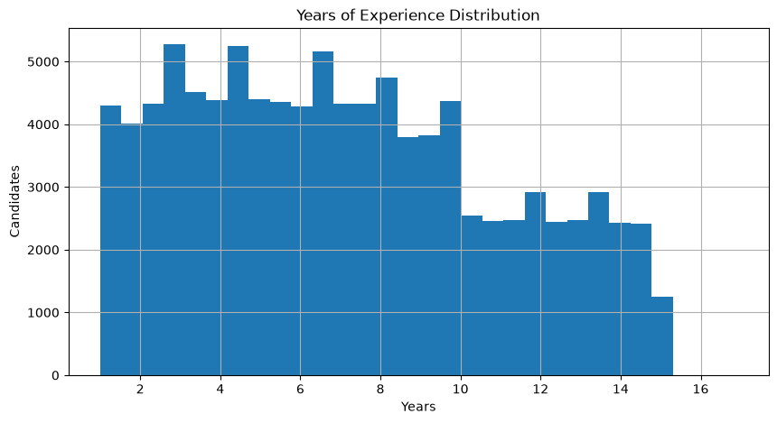
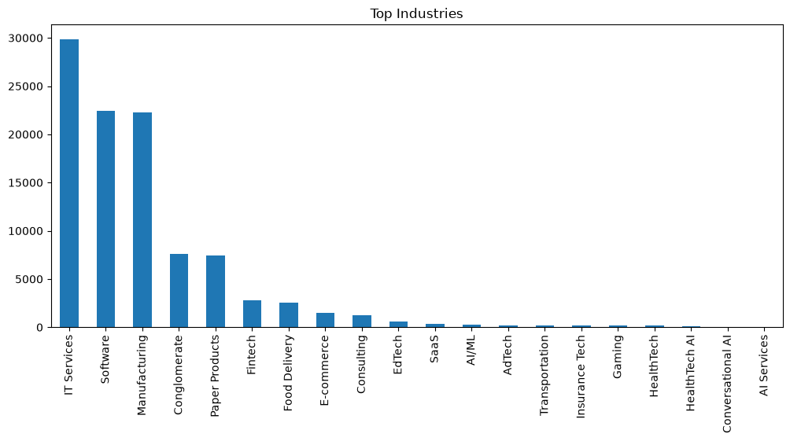
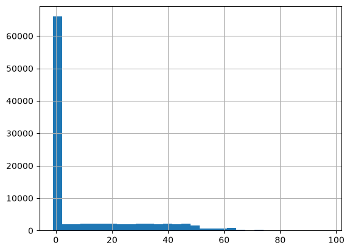

# Sprint 1 - Exploratory Data Analysis (EDA)

## Dataset Overview

### Total Candidates
- 100,000 candidate profiles

### Initial Observation
- The dataset is large enough to require efficient retrieval.
- Running an LLM on every candidate during ranking is infeasible.
- Candidate preprocessing must be performed offline.

---

# Observation 1 - Years of Experience

Statistics

- Average Experience: 7.17 years
- Median Experience: 6.8 years
- Minimum: 1 year
- Maximum: 16.9 years

# YOE graph

Insights

- The dataset is dominated by mid-level professionals.
- There are relatively fewer highly experienced candidates (>15 years).
- Years of experience alone should never be used as the primary ranking metric.

Decision

- Convert years of experience into normalized features.
- Use it as one ranking signal instead of a hard filter.

Future Feature

experience_score ∈ [0,1]

---

# Observation 2 - Industry Distribution

Top Industries

1. IT Services
2. Software
3. Manufacturing
4. Conglomerates
5. Paper Products

# Industry distribution graph

Insights

- Most candidates come from traditional software companies.
- AI/ML-specific industries form only a very small portion of the dataset.
- Therefore, industry alone cannot indicate AI expertise.

Decision

- Industry should have a very small influence on ranking.
- Career history is expected to contain much richer information than industry labels.

---

# Observation 3 - Company Size

Largest Groups

10001+ Employees

1001-5000 Employees

201-500 Employees

Insights

- Most candidates have worked in large enterprises.
- Startup candidates are relatively rare.

Decision

- Company size should not directly improve ranking.
- Instead, it can contribute to inferred traits such as startup exposure or enterprise experience.

Future Feature

enterprise_experience

startup_experience

---

# Observation 4 - Open To Work

Results

Open To Work
True : 35%

False : 65%

Insights

- Most candidates are not actively looking for jobs.
- Availability is an important recruiter signal.

Decision

- Use Open-to-Work as a behavioral feature.
- Never use it as a hard filter.

Future Feature

availability_score

---

# Observation 5 - Notice Period

Statistics

Average : 87 days

Median : 90 days

Range : 0–150 days

Insights

- Most candidates require approximately 90 days before joining.
- Very short notice periods are uncommon.

Decision

- Convert notice period into a normalized score instead of using raw values.

Future Feature

notice_score

---

# Observation 6 - GitHub Activity

Statistics

Mean : 9.62

Median : -1

Maximum : 96.9

# git graph

Important Finding

A GitHub score of -1 appears frequently.

Hypothesis

-1 most likely represents:

"No GitHub profile available"

rather than zero activity.

Decision

- Never treat -1 as a numeric score.
- Convert it into a missing-value indicator.

Future Features

has_github

github_activity_score

---

# Observation 7 - Recruiter Response Rate

Statistics

Average : 43.6%

Median : 44%

Maximum : 95%

Insights

- Recruiter response is already normalized.
- This is likely one of the strongest behavioral indicators.

Decision

- Feed directly into the Ranking Intelligence Layer.
- No LLM processing required.

Future Feature

response_probability

---

# Engineering Decisions

✓ Candidate preprocessing will happen offline.

✓ Behavioral signals should bypass the LLM.

✓ Career history is expected to become the primary textual source.

✓ Profile summary will become a secondary textual source.

✓ Semantic search should use career history + profile summary.

✓ Behavioral signals should influence ranking after semantic retrieval.
